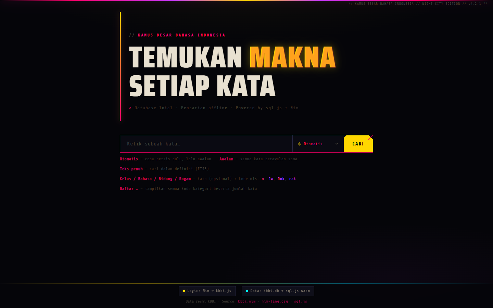

# KBBI - Kamus Besar Bahasa Indonesia

<div align="center">
  <a href="https://www.codefactor.io/repository/github/univzy/kbbi/overview/master">
    
  </a>
  <a href="https://github.com/univzy/kbbi/issues">
    
  </a>
</div>
<div align="center">
  <a href="https://nim-lang.org">
    
  </a>
  <a href="https://github.com/univzy/kbbi/stargazers/">
    
  </a>
  <a href="https://github.com/univzy/kbbi/network/members">
    
  </a>
  <a href="https://github.com/univzy/kbbi/watchers">
    
  </a>
  <a href="https://github.com/univzy/kbbi/blob/master/LICENSE">
    
  </a>
  <a href="#">
    
  </a>
</div>

> A modern, lightweight offline Indonesian dictionary based on KBBI, designed for fast and reliable word lookup.

<div align="center">
  <p>Support the project with a ⭐ and fork to contribute!</p>
</div>



---

## 🚀 Quick Start

### Prerequisites

- [Nim](https://nim-lang.org) ≥ 2.2.8 ([install](https://nim-lang.org/install.html))
- The KBBI Android APK file (download from [Google Play Store](https://play.google.com/store/apps/details?id=yuku.kbbi5) or an APK mirror)
- Optional: Python 3 for local HTTP server (browser testing)

### 1️⃣ Build Tools

```bash
# Install dependencies (zippy, db_connector from Nimble)
nimble install

# Build all tools at once
nimble buildall

# Or individually:
nimble builddb      # build kbbi_build (database builder)
nimble buildse      # build kbbi_search (CLI tool)
nimble buildjs      # build kbbi_js (web frontend)
```

### 2️⃣ Extract Dictionary Data

See [Extracting data from the APK](docs/extract.md) for detailed steps.

```bash
# Quick extraction (Linux/macOS/WSL)
cp KBBI.apk kbbi.zip
unzip kbbi.zip "dictdata/*" -d kbbi_extracted/

# Windows: Open .zip in Explorer and copy dictdata/ folder
```

### 3️⃣ Build the Database

```bash
# This creates kbbi.db
./bin/kbbi_build path/to/dictdata/ kbbi.db
```

### 4️⃣ Use Your Dictionary

**CLI search:**
```bash
./bin/kbbi_search kbbi.db apa              # prefix search
./bin/kbbi_search kbbi.db --exact apa      # exact match
./bin/kbbi_search kbbi.db --fts berdikari  # full-text search
./bin/kbbi_search kbbi.db --kat bahasa Jw  # filter by language (Javanese)
./bin/kbbi_search kbbi.db --list kelas     # list all word classes
./bin/kbbi_search kbbi.db --id 9271        # look up by entry ID
```

**Browser app:**
```bash
# Copy built files to one directory
cp pages/index.html pages/style.css pages/kbbi.js kbbi.db ./app/

# Serve locally
python -m http.server 8080 --directory app/
```

Open **http://localhost:8080** in your browser.

---

## 🏗️ Architecture

### Components

| Component | Purpose | Input | Output |
|-----------|---------|-------|--------|
| `kbbi_build` | Extract & parse encrypted dictionary, build SQLite database | `dictdata/` folder | `kbbi.db` |
| `kbbi_search` | CLI search tool — prefix, exact match, full-text, category filtering | `kbbi.db` | Terminal output |
| `kbbi_js` | Browser frontend — compiles to JavaScript using sql.js for client-side queries | `kbbi.db` | `pages/kbbi.js` |

### Data flow

```
KBBI APK
   ↓ (extract)
dictdata/acu_*.s (encrypted, gzip'd)
   ↓ (decrypt with Salsa20, decompress)
Binary entry data
   ↓ (parse with varint decoder)
Entry / Sense / XrefGroup objects (in-memory)
   ↓ (insert)
SQLite entries, senses, xrefs, categories tables
   ↓ (query)
CLI tool OR Browser app (sql.js)
```
---

## 📚 Documentation

| Guide | Description |
|-------|-------------|
| [Extracting Data](docs/extract.md) | Step-by-step guide to extract the KBBI APK and locate dictionary data |
| [Encryption & Decryption](docs/crypto.md) | How Salsa20 cipher and gzip compression protect the data |
| [Finding the Key](docs/key.md) | Techniques to reverse-engineer encryption keys from APK releases |
| [Data Types](docs/types.md) | Entry structures, senses, categories, and cross-references |
| [Database Schema](docs/schema.md) | Complete SQLite schema with all tables and indexes |
| [Web App Guide](docs/webapp.md) | Browser-based search, FTS5 full-text search, offline caching |

**Read these in order for best understanding:** Extract → Crypto → Key → Types → Schema → Webapp

---

## 📖 References

- [Moeljadi, D., Kamajaya, I., & Amalia, D. (2017).  
  *Building the Kamus Besar Bahasa Indonesia (KBBI) Database and Its Applications*.  
  ASIALEX 2017.](https://www.researchgate.net/publication/318686182_Building_the_Kamus_Besar_Bahasa_Indonesia_KBBI_Database_and_Its_Applications)

---

## ⚖️ License & Legal Disclaimer

**Code:** MIT License — See [LICENSE](LICENSE) for details.

**Dictionary Data:** The KBBI dictionary data is owned and copyrighted by **Badan Pengembangan dan Pembinaan Bahasa, Kementerian Pendidikan Dasar dan Menengah** (The Language Development and Enhancement Agency, Indonesian Ministry of Education and Culture).

### Important Legal Notice

This project is provided **for personal, educational, and research purposes only**. Users must be aware of the following:

1. **Encryption Circumvention:** This project reverses and decrypts the Salsa20-protected KBBI data. Under Indonesian Law No. 28 of 2014 (Undang-Undang Hak Cipta), **Article 52** prohibits circumventing technological protection measures without authorization, except for defense and national security purposes or as otherwise provided by law.

2. **Copyright Ownership:** All dictionary content remains the intellectual property of the Indonesian government. This project does not claim ownership of the data.

3. **No Commercial Use:** This tool must not be used for commercial, profit-making, or revenue-generating purposes without explicit authorization from the copyright holder.

4. **Use at Your Own Risk:** Users are solely responsible for ensuring their use complies with Indonesian copyright law and relevant jurisdictions. The authors assume no legal liability for misuse.

5. **Seek Legal Counsel:** If you intend to use this project beyond personal/educational purposes, **consult an Indonesian IP lawyer** to verify compliance before proceeding.

### Attribution

If you use this project, please attribute the original KBBI data source:
> Kamus Besar Bahasa Indonesia (KBBI) — Badan Pengembangan dan Pembinaan Bahasa

This project is **not affiliated with or endorsed by the Indonesian government**.
